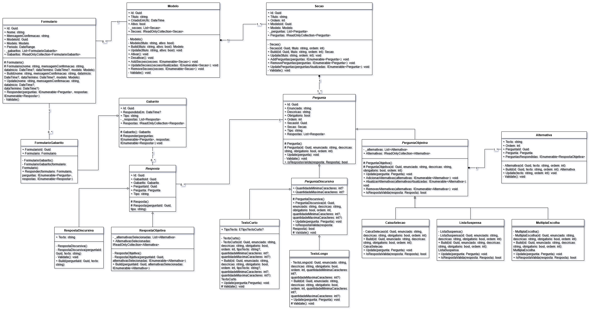

# 🧩 Forms – Sistema de Formulários Dinâmicos em C#



## 📘 Sobre o Projeto

O **Forms** é um sistema desenvolvido em **C# (.NET)** que aplica os **conceitos de Programação Orientada a Objetos (POO)** para o gerenciamento dinâmico de **formulários de pesquisa**.  
O sistema foi construído como parte do **Trabalho de Conclusão de Curso (TCC)** do curso de **Sistemas de Informação da Faculdade Multivix**, com o objetivo de demonstrar, de forma prática, a aplicação dos pilares da POO — **encapsulamento, herança, polimorfismo e abstração** — no design e na implementação de um software real.

---

## 🎯 Objetivo

Desenvolver um sistema modular e extensível capaz de:
- Criar modelos de formulários dinâmicos;
- Incluir diferentes tipos de perguntas (discursivas, objetivas, múltipla escolha etc.);
- Armazenar e validar respostas;
- Gerar gabaritos e processar resultados automaticamente.

---

## 🧱 Arquitetura e Modelagem

A estrutura do sistema foi projetada com base em **UML (Unified Modeling Language)**, utilizando **diagramas de classes** para representar as relações entre os principais componentes.  
A modelagem reflete o uso dos pilares da POO:

- **Encapsulamento** → Atributos e métodos protegidos, garantindo a integridade dos dados.  
- **Herança** → Hierarquia de classes de perguntas (ex.: `PerguntaObjetiva`, `PerguntaDiscursiva`).  
- **Polimorfismo** → Implementações específicas do método `IsRespostaValida()` conforme o tipo de pergunta.  
- **Abstração** → Classes base e interfaces que definem comportamentos genéricos para especializações.

---

## 🧠 Tecnologias Utilizadas

| Categoria | Tecnologias |
|------------|--------------|
| Linguagem | C# |
| Framework | .NET 8 |
| Banco de Dados | PostgreSQL |
| Padrões de Projeto | MVC, Repository, SOLID |
| Modelagem | UML (Visual Paradigm / Draw.io) |
| Metodologia | Scrum (Sprints, Backlog, Review, Retrospective) |

---

## ⚙️ Funcionalidades Principais

✅ Criação dinâmica de formulários com seções e perguntas  
✅ Suporte a múltiplos tipos de perguntas  
✅ Geração e vinculação de gabaritos  
✅ Registro e validação de respostas  
✅ Persistência de dados em banco de dados  
✅ Estrutura extensível para novos tipos de perguntas  

---

## 🚀 Como Executar o Projeto

```bash
# Clonar o repositório
git clone https://github.com/jotapersantos/forms.git

# Entrar na pasta
cd forms

# Restaurar dependências
dotnet restore

# Executar o projeto
dotnet run
```

---

## 🧩 Diagrama UML

O diagrama a seguir representa a **estrutura de classes** do sistema, evidenciando os relacionamentos de herança, composição e agregação entre as principais entidades:


---

## 👨‍💻 Autores

**Acadêmicos:**  
- Guilherme Dias Maria  
- João Paulo Rodrigues Santos  
- Lorena Carvalho Marques  

**Orientador:**  
- Prof. André Bessa da Silva  
_Mestre em Pesquisa Operacional e Inteligência Computacional – Multivix Vitória_

---

## 🏁 Conclusão

O projeto **Forms** comprova que a **Programação Orientada a Objetos** é uma abordagem eficaz para o desenvolvimento de sistemas escaláveis, modulares e de fácil manutenção.  
Sua aplicação no contexto de um sistema de formulários de pesquisa mostrou como a teoria pode ser traduzida em prática, resultando em uma solução robusta e academicamente relevante.
